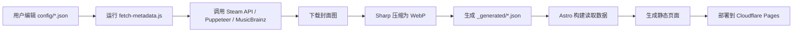

# Logbook - 个人数字内容策展平台

一个基于 Astro 4.x 构建的现代化个人内容管理平台，自动捕捉和展示您在游戏、电影、书籍、音乐等领域的数字足迹。

## 核心特性

- 🎯 **自动化数据管道**：只需添加链接，系统自动获取元数据、下载封面、压缩图片
- 🎨 **智能主题适配**：从壁纸自动提取主色调，动态调整全站配色方案
- 📱 **响应式设计**：完美适配桌面端和移动端，支持触摸交互
- ⚡ **极致性能**：静态站点生成 + WebP 图片格式，加载速度极快
- 🔄 **无缝更新**：通过 GitHub Actions 实现一键数据同步
- 🎭 **沉浸式体验**：视差滚动、毛玻璃效果、3D 卡片悬停动画

## 技术架构

### 核心技术栈

- **框架**: [Astro 4.x](https://astro.build/) - 静态站点生成器，原生 Markdown 支持
- **数据处理**: Node.js + Puppeteer（无头浏览器，用于豆瓣抓取）+ Steam / MusicBrainz 开放 API
- **图片处理**: Sharp - 高性能图片转换和压缩库
- **自动化**: GitHub Actions - 手动触发数据抓取（`.github/workflows/manual-fetcher.yml`）
- **部署**: Cloudflare Pages - 全球边缘网络部署（连接 Git 仓库后自动构建）

### 项目结构

```
logbook/
├── .github/
│   └── workflows/
│       └── manual-fetcher.yml      # GitHub Actions 工作流（手动触发数据抓取并提交）
├── scripts/                         # 数据抓取管线（Node.js，非 Astro 构建的一部分）
│   ├── fetch-metadata.js            # 入口脚本：读取配置 → 抓取 → 生成 _generated/*.json
│   └── lib/
│       ├── paths.js                 # 目录常量与待处理的配置文件列表
│       ├── url.js                   # URL → {platform, id, type} 解析规则
│       ├── refresh.js               # 判断某条目是否需要重新抓取
│       ├── image.js                 # 下载封面并转 WebP（含豆瓣防盗链 Referer）
│       ├── util.js                  # delay / backoff 等小工具
│       └── providers/
│           ├── steam.js             # Steam 商店 API 抓取
│           ├── douban.js            # 豆瓣网页抓取（Puppeteer + 反爬挑战解算）
│           └── musicbrainz.js       # MusicBrainz + Cover Art Archive 抓取
├── src/
│   ├── config/                      # 💡 用户配置目录（日常维护区域）
│   │   ├── profile.json             # 个人信息：头像、简介、社交链接、壁纸
│   │   ├── games.json               # Steam 游戏链接列表
│   │   ├── movies.json              # 豆瓣电影链接列表
│   │   ├── books.json               # 豆瓣图书链接列表
│   │   └── albums.json              # 豆瓣音乐专辑链接列表
│   ├── content/
│   │   ├── posts/
│   │   │   └── other.md             # “其他”页面的自定义 Markdown 内容
│   │   └── _generated/              # ⛔ 自动生成目录（勿手动修改）
│   │       ├── games.json           # 游戏元数据（标题、描述、封面等）
│   │       ├── movies.json          # 电影元数据
│   │       ├── books.json           # 图书元数据
│   │       └── albums.json          # 专辑元数据
│   ├── pages/                       # 页面路由
│   │   ├── index.astro              # 首页（全屏英雄区 + 内容切换标签页）
│   │   ├── [collection].astro       # 集合独立页（动态路由，按 config key 生成）
│   │   └── other.astro              # “其他”内容页面
│   ├── layouts/
│   │   └── Layout.astro             # 全局布局（含主题色提取逻辑）
│   ├── styles/
│   │   └── global.css               # 全局样式（约 1240 行，Acrylic 毛玻璃设计）
│   ├── components/
│   │   ├── EntryCard.astro          # 条目卡片（游戏/电影/书/专辑共用）
│   │   └── Footer.astro             # 页脚
│   ├── lib/
│   │   ├── collections.ts           # 集合展示配置 + 数据加载 + 渲染辅助
│   │   └── theme.ts                 # 主题色采样（canvas 平均色）与滚动淡出
│   └── utils/                       # 前端复用工具函数
├── public/
│   ├── generated/                   # 生成的 WebP 封面图片
│   └── favicon.ico                  # 网站图标
├── astro.config.mjs                 # Astro 配置文件
├── package.json                     # 项目依赖和脚本
└── README.md                        # GitHub 个人主页展示文档（与本文件不同）
```

> 注意：本文件（`README-Logbook.md`）描述项目真实结构。GitHub 个人主页使用的是仓库根目录的 `README.md`。

## 快速开始

### 前置条件

- Node.js v18+（推荐 v20+）
- npm 或 pnpm 包管理器
- Git

### 安装步骤

1. **克隆仓库**

```bash
git clone https://github.com/hohouman/logbook.git
cd logbook
```

2. **安装依赖**

```bash
npm install
```

3. **配置个人信息**

编辑 `src/config/profile.json`：

```json
{
  "name": "你的名字",
  "bio": "个人简介",
  "avatar": "头像URL（支持本地路径或外部链接）",
  "wallpaper": "壁纸URL（用于首页背景和主题色提取）",
  "social": {
    "github": "https://github.com/yourusername",
    "email": "your@email.com",
    "twitter": "",
    "instagram": "",
    "telegram": "",
    "facebook": ""
  },
  "links": [
    { "label": "我的博客", "href": "https://blog.example.com" }
  ]
}
```

4. **添加内容链接**

在对应的配置文件中添加链接（每行一个 URL）。目前支持以下平台：

| 集合        | 配置文件              | 支持的链接来源                                              |
| ----------- | --------------------- | ----------------------------------------------------------- |
| 游戏 games  | `src/config/games.json`   | `store.steampowered.com/app/<id>`（Steam）                  |
| 电影 movies | `src/config/movies.json`  | `movie.douban.com/subject/<id>`（豆瓣）                    |
| 图书 books  | `src/config/books.json`   | `book.douban.com/subject/<id>`（豆瓣）                     |
| 专辑 albums | `src/config/albums.json`  | `music.douban.com/subject/<id>`（豆瓣）、`musicbrainz.org/release/<id>` |

> 不支持 Epic 等其它平台；新增平台需要在 `scripts/lib/url.js` 增加解析规则并在 `scripts/lib/providers/` 增加对应抓取器。

示例（`src/config/games.json`）：

```json
[
  "https://store.steampowered.com/app/264710",
  "https://store.steampowered.com/app/870780"
]
```

5. **运行数据抓取脚本**（首次使用必须）

```bash
npm run fetch-data
# 或
node ./scripts/fetch-metadata.js
```

此脚本会：

- 读取配置文件中的链接
- 调用 Steam API / 豆瓣网页抓取 / MusicBrainz API 获取元数据
- 下载封面图并转换为 WebP 格式
- 生成 `src/content/_generated/*.json` 文件
- 将 WebP 写入 `public/generated/`

6. **本地开发**

```bash
npm run dev
```

访问 http://localhost:4321 预览效果。

7. **构建生产版本**

```bash
npm run build
```

输出目录：`dist/`。

## 自动化工作流

### GitHub Actions 手动触发

1. 前往 GitHub 仓库 → **Actions** 标签页
2. 选择 **“Manual Logbook Data Fetcher”** 工作流
3. 点击 **“Run workflow”** 按钮
4. 工作流自动：克隆 → 安装依赖 → 运行 `node ./scripts/fetch-metadata.js` → 若有变更则提交 `Auto-update logbook data` 并推送到 `main`（推送会触发 Cloudflare Pages 重新部署）

> 工作流只负责抓取与提交数据，不负责部署；部署由 Cloudflare Pages 监听 `main` 分支完成。

### 本地手动触发

```bash
npm run fetch-data
```

然后手动提交：

```bash
git add .
git commit -m "Update content data"
git push origin main
```

## 自定义指南

### 修改主题色

主题色从 `profile.json` 中的 `wallpaper` 自动提取（见 `src/lib/theme.ts`：用 canvas 对壁纸做平均色采样并写入 CSS 变量），无需手动设置。

如需强制指定颜色：编辑 `src/styles/global.css` 中的 `--theme-color` 与 `--theme-color-rgb` 变量，并在 `src/layouts/Layout.astro` 的 `<script>` 中跳过 `initTheme()` 调用（或注释掉相关逻辑）。

### 添加新的社交媒体

1. 在 `src/config/profile.json` 的 `social` 中添加新字段（值为空字符串的条目不会显示）。
2. 在 `src/pages/index.astro` 的 `iconPaths` 中添加对应 SVG path；若没有现成图标，会回退到 `default` 图标。

### 修改页面布局

所有页面都使用统一的 `<Layout>` 组件（`src/layouts/Layout.astro`）：

```astro
---
import Layout from '../layouts/Layout.astro';
---

<Layout title="页面标题" wallpaper={profile.wallpaper}>
  <div slot="hero">
    <!-- 英雄区内容 -->
  </div>

  <main>
    <!-- 主要内容 -->
  </main>
</Layout>
```

集合独立页由 `src/pages/[collection].astro` 通过 `getStaticPaths()` 按集合 key 动态生成，无需为每个集合手写页面。

### 自定义“其他”页面

编辑 `src/content/posts/other.md`，支持标准 Markdown 语法（表格、引用、图片等均已适配深色玻璃卡片样式）。

## 数据格式说明

### 配置文件格式

配置均为 URL 数组，详见上文“添加内容链接”。

### 生成的数据格式

脚本生成的 `src/content/_generated/*.json` 是一个条目数组，字段含义如下（以游戏为例）：

```json
[
  {
    "id": "264710",
    "title": "Subnautica",
    "developer": ["Unknown Worlds Entertainment"],
    "publisher": ["Unknown Worlds Entertainment"],
    "releaseDate": "Jan 23, 2018",
    "description": "游戏简短描述...",
    "coverUrl": "https://cdn.akamai.steamstatic.com/steam/apps/264710/header.jpg",
    "posterUrl": "https://cdn.akamai.steamstatic.com/steam/apps/264710/library_600x900.jpg",
    "localCoverPath": "/generated/game_264710_cover.webp",
    "localPosterPath": "/generated/game_264710_poster.webp",
    "type": "game",
    "platform": "steam",
    "url": "https://store.steampowered.com/app/264710/"
  }
]
```

- `coverUrl` / `posterUrl` 为原始远程地址；`localCoverPath` / `localPosterPath` 为本地生成的 WebP 相对路径。
- 不同集合的条目只填充对应语义字段（如电影填 `director`、图书填 `author`、专辑填 `artist`），无关的数组字段可能为空数组。
- 渲染层（`EntryCard.astro`）通过 `src/lib/collections.ts` 中每个集合的 `metaFields` / `coverKeys` 配置决定展示哪些字段，与底层数据字段解耦。

## 故障排除

### 问题：豆瓣数据抓取失败

**原因**：豆瓣有反爬虫机制（JavaScript 工作量证明挑战）。

**解决方案**：

1. 确保安装了 Puppeteer（已包含在 devDependencies）。
2. 检查 `scripts/lib/providers/douban.js` 中的 `solveChallenge()` 函数。
3. 抓取脚本内置了 SHA-512 挑战解算与备用正则兜底，失败时查看控制台日志。

### 问题：Steam / MusicBrainz 返回空数据

**原因**：应用可能没有公开数据或已被移除。

**解决方案**：

1. 检查链接是否正确（必须是完整的商店 / release 链接）。
2. 确认 id 存在且可访问。
3. 查看控制台日志中的错误信息。

### 问题：图片未显示

**原因**：WebP 图片未生成或路径错误。

**解决方案**：

1. 重新运行 `npm run fetch-data`。
2. 检查 `public/generated/` 目录是否有 `.webp` 文件。
3. 确认 `_generated/*.json` 中的 `localCoverPath` / `localPosterPath` 路径正确。

### 问题：主题色不匹配壁纸

**原因**：主题色提取依赖跨域图片的 CORS 头；若图片服务器不允许跨域读取，会回退到 `--theme-color` 默认值。

**解决方案**：更换允许 CORS 的壁纸，或在 `global.css` 中手动指定 `--theme-color`。

## 部署指南

### Cloudflare Pages（推荐）

1. 登录 [Cloudflare Dashboard](https://dash.cloudflare.com/) → **Pages** → **Create a project** → **Connect to Git** → 选择本仓库。
2. 构建设置：
   - **Build command**: `npm run build`
   - **Build output directory**: `dist`
   - **Node.js version**: `20`（或更高）
3. 每次推送到 `main` 分支会自动触发构建与部署；GitHub Actions 更新数据后推送也会触发。

### Vercel / Netlify / 自托管

构建命令均为 `npm run build`，发布目录均为 `dist/`。自托管可用任意静态服务器，例如 `npx serve dist`。

## AI Agent 使用指南

本部分专为 AI 助手（如 GitHub Copilot、Cursor、CodeBuddy 等）设计，帮助 AI 快速理解和操作本项目。**请严格依据本文件描述的真实结构操作，不要凭空假设文件。**

### 项目认知要点

#### 1. 核心设计理念

- **数据驱动**：内容由 `src/config/*.json` 的 URL 列表驱动，抓取脚本生成 `src/content/_generated/*.json`。
- **配置与展示分离**：集合的“展示配置”（标题、卡片字段等）集中在 `src/lib/collections.ts`，与“数据”解耦。
- **自动化优先**：通过脚本自动获取元数据，减少人工维护。
- **静态生成**：Astro 在构建时生成纯 HTML/CSS/JS，无运行时服务端依赖。
- **渐进增强**：基础内容无需 JavaScript，主题色与标签页交互通过客户端 JS 增强。

#### 2. 关键文件映射关系

```
用户输入（链接）
    ↓
src/config/*.json (games.json, movies.json, ...)
    ↓
scripts/fetch-metadata.js + scripts/lib/*
    ↓
src/content/_generated/*.json (生成的元数据)
    ↓
public/generated/*.webp (压缩后的封面图)
    ↓
src/pages/[collection].astro + src/lib/collections.ts (读取生成数据并渲染)
    ↓
dist/ (最终构建产物)
```

#### 3. 数据流向图



### AI 操作清单

#### 当用户说“添加一个新游戏”时：

1. **定位配置文件**：`src/config/games.json`
2. **添加链接**：在数组末尾添加 Steam 商店链接
3. **运行脚本**：`npm run fetch-data`
4. **验证结果**：
   - 检查 `src/content/_generated/games.json` 是否包含新游戏
   - 检查 `public/generated/` 是否有新的 `.webp` 文件
5. **提交更改**：`git add . && git commit -m "Add new game" && git push`

#### 当用户说“修改个人信息”时：

1. **定位配置文件**：`src/config/profile.json`
2. **修改字段**：`name` / `bio` / `avatar` / `wallpaper`（影响全站主题色）/ `social.*` / `links[]`
3. **无需运行脚本**：直接保存即可
4. **预览效果**：`npm run dev`

#### 当用户说“修改样式”时：

1. **定位样式文件**：`src/styles/global.css`
2. **常用修改位置**：
   - 顶部 `:root`：所有设计令牌（颜色、字体、阴影、圆角）
   - `.glass-panel` 等 utility：统一的毛玻璃表面
   - 各组件区块（英雄区、菜单栏 `content-tabs`、卡片 `entry-card`、文字等）
3. **主题色变量**：
   ```css
   --theme-color: #xxx;           /* 主色调 */
   --theme-color-rgb: r, g, b;    /* RGB 格式 */
   --on-hero: #fff7ef;            /* 英雄区前景文字色 */
   ```
4. **测试更改**：`npm run dev`

#### 当用户说“修复滚动问题”时：

1. **定位相关代码**：`src/pages/index.astro` 的 `<script>` 标签内（标签页切换与滚动逻辑）
2. **查找滚动逻辑**：搜索 `hero-scroll-link` 或 `window.scrollTo`
3. **常见问题**：
   - 滚动位置不准确 → 检查 `getBoundingClientRect()` 计算
   - 滚动不平滑 → 确认 `behavior: 'smooth'`
   - 箭头按钮不显示 → 检查 `Layout.astro` 中的条件渲染（`heroFullscreen` 才渲染 `.hero-scroll-link`）

#### 当用户说“优化性能”时：

1. **图片优化**：所有封面使用 WebP（`scripts/lib/image.js` 中由 Sharp 处理，质量 80）
2. **代码分割**：Astro 自动进行，无需手动配置
3. **缓存策略**：Cloudflare Pages 自动缓存静态资源

### AI 调试技巧

#### 1. 查看生成日志

运行脚本时查看控制台详细日志（抓取器会打印每个条目的语言/平台/兜底情况）。

#### 2. 检查生成的数据

```bash
cat src/content/_generated/games.json | jq '.[0]'
ls -lh public/generated/
du -sh public/generated/*
```

#### 3. 验证页面渲染

```bash
npm run dev
# 访问页面并检查：控制台错误、Network 面板图片加载、Elements 面板 DOM 结构
```

#### 4. 调试主题色提取

在 `src/lib/theme.ts` 的 `applyThemeColor()` 中临时 `console.log` 采样结果。

### AI 最佳实践

#### ✅ 推荐做法

1. **始终先运行脚本**：修改配置文件后，立即运行 `npm run fetch-data`
2. **保持图片一致性**：所有封面统一使用 WebP 格式
3. **遵循命名约定**：配置文件小写 `.json`；生成文件位于 `_generated/`；图片 `public/generated/{type}_{id}_{cover|poster}.webp`
4. **测试后再提交**：本地运行 `npm run dev` 验证效果

#### 避免做法

1. **不要手动修改 `_generated/` 目录**：这些文件由脚本自动生成
2. **不要硬编码数据**：所有内容应从配置文件读取
3. **不要忽略脚本错误**：抓取脚本的错误日志很重要
4. **不要直接修改 `dist/` 目录**：这是构建产物，会被覆盖
5. **不要忘记提交生成的文件**：`_generated/*.json` 与 `public/generated/*.webp` 都需要提交

### AI 快捷命令参考

```bash
npm run dev          # 启动开发服务器
npm run build        # 构建生产版本
npm run preview      # 预览生产构建
npm run fetch-data   # 运行数据抓取脚本

git status / git add . / git commit -m "msg" / git push origin main

cat src/config/profile.json
cat src/content/_generated/games.json
ls -lh public/generated/
```

### AI 常见问题解答

**Q: 如何添加新的内容类型（如动漫、漫画）？**

A:

1. 创建 `src/config/anime.json` 配置文件（URL 数组）。
2. 在 `scripts/lib/url.js` 的 `MATCHERS` 增加该平台的 URL 解析规则；若需新数据源，在 `scripts/lib/providers/` 增加抓取器并在 `fetch-metadata.js` 的 `fetchByPlatform()` 接入。
3. 在 `src/lib/collections.ts` 的 `collections` 中增加该集合的展示配置（key、导航文案、卡片字段、封面来源等），并加入 `collectionList`。
4. 路由无需新建页面——`src/pages/[collection].astro` 已通过 `getStaticPaths()` 按集合 key 动态生成。
5. 运行 `npm run fetch-data` 生成数据。

**Q: 如何修改箭头按钮的滚动目标？**

A: 编辑 `src/layouts/Layout.astro` 中 `.hero-scroll-link` 的结构，以及 `src/pages/index.astro` 中对应的 `scrollLink` 点击逻辑（基于 `getBoundingClientRect()` 计算）。

**Q: 如何禁用自动主题色提取？**

A: 在 `src/layouts/Layout.astro` 的 `<script>` 中跳过 `initTheme()`，并在 `src/styles/global.css` 中手动设置 `--theme-color` 等变量。

**Q: 如何在本地测试 GitHub Actions？**

A: 使用 [act](https://github.com/nektos/act)：`act workflow_dispatch`（注意 Puppeteer 在容器内需要额外系统依赖）。

**Q: 如何优化豆瓣抓取成功率？**

A:

1. 增加 Puppeteer 的超时时间
2. 调整 `solveChallenge()` 中的难度参数
3. 使用代理 IP（需要额外配置）
4. 降低抓取频率（脚本已内置 `delay(1000)` 控频），避免被封禁

## 更新日志

### 2026-07-10

- 📝 重写 `README-Logbook.md`，使其与真实代码一致：修正脚本结构（已拆分到 `scripts/lib`）、主题色提取（canvas 平均色，非 colorthief）、页面路由（`[collection].astro` 动态路由，非独立页面）、支持平台（不含 Epic）、全局样式行数等；修正“AI Agent 指南”中的文件路径与新增类型流程。

### 更早的更新

- 修复箭头按钮滚动逻辑，使用 `getBoundingClientRect()` 精确计算位置
- 给所有内容面板的 `section-eyebrow` 添加唯一 ID
- 提高正文文字对比度，改善可读性
- 统一菜单栏和内容面板宽度对齐
- 简化底部版权栏，移除背景遮罩
- 完善自动化数据管道
- 添加 Acrylic 毛玻璃设计
- 集成主题色自动提取
- 支持 Steam、豆瓣、MusicBrainz 数据源

## 致谢

- [Astro](https://astro.build/) - 优秀的静态站点生成器
- [Sharp](https://sharp.pixelplumbing.com/) - 高性能图片处理库
- [Puppeteer](https://pptr.dev/) - 无头浏览器自动化
- [Cloudflare Pages](https://pages.cloudflare.com/) - 全球边缘部署平台
