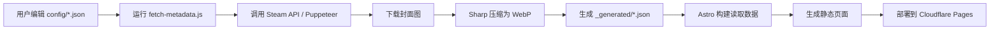

# Logbook - 个人数字内容策展平台

一个基于 Astro 4.x 构建的现代化个人内容管理平台，自动捕捉和展示您在游戏、电影、书籍、音乐等领域的数字足迹。

##  核心特性

- 🎯 **自动化数据管道**：只需添加链接，系统自动获取元数据、下载封面、压缩图片
- 🎨 **智能主题适配**：从壁纸自动提取主色调，动态调整全站配色方案
- 📱 **响应式设计**：完美适配桌面端和移动端，支持触摸交互
- ⚡ **极致性能**：静态站点生成 + WebP 图片格式，加载速度极快
-  **无缝更新**：通过 GitHub Actions 实现一键数据同步
- 🎭 **沉浸式体验**：视差滚动、毛玻璃效果、3D 卡片悬停动画

## ️ 技术架构

### 核心技术栈
- **框架**: [Astro 4.x](https://astro.build/) - 静态站点生成器，原生 Markdown 支持
- **数据处理**: Node.js + Puppeteer（无头浏览器）+ Steam API
- **图片处理**: Sharp - 高性能图片转换和压缩库
- **自动化**: GitHub Actions - 定时/手动触发数据抓取
- **部署**: Cloudflare Pages - 全球边缘网络部署

### 项目结构
```
logbook/
├── .github/
│   └── workflows/
│       ── manual-fetcher.yml    # GitHub Actions 工作流配置
├── scripts/
│   ├── fetch-metadata.js         # 核心数据抓取脚本（787行）
│   └── debug-douban.js           # 豆瓣反爬虫调试工具
├── src/
│   ├── config/                   # 💡 用户配置目录（日常维护区域）
│   │   ├── profile.json          # 个人信息：头像、简介、社交链接、壁纸
│   │   ├── games.json            # Steam/Epic 游戏链接列表
│   │   ├── movies.json           # 豆瓣电影链接列表
│   │   ├── books.json            # 豆瓣图书链接列表
│   │   └── albums.json           # 音乐专辑信息（可选）
│   ├── content/
│   │   ├── posts/
│   │   │   └── other.md          # "其他"页面的自定义 Markdown 内容
│   │   └── _generated/           # ⛔ 自动生成目录（勿手动修改）
│   │       ├── games.json        # 游戏元数据（标题、描述、封面等）
│   │       ├── movies.json       # 电影元数据
│   │       ├── books.json        # 图书元数据
│   │       └── albums.json       # 专辑元数据
│   ├── pages/                    # 页面路由
│   │   ├── index.astro           # 首页（全屏英雄区 + 内容切换）
│   │   ├── games.astro           # 游戏独立页面
│   │   ├── movies.astro          # 电影独立页面
│   │   ├── books.astro           # 图书独立页面
│   │   ├── albums.astro          # 专辑独立页面
│   │   └── other.astro           # 其他内容页面
│   ├── layouts/
│   │   └── Layout.astro          # 全局布局（含主题色提取逻辑）
│   ├── styles/
│   │   └── global.css            # 全局样式（1296行，Acrylic 毛玻璃设计）
│   ├── components/               # 可复用组件
│   └── utils/                    # 工具函数
├── public/
│   ├── generated/                # 生成的 WebP 封面图片
│   └── favicon.ico               # 网站图标
├── astro.config.mjs              # Astro 配置文件
├── package.json                  # 项目依赖和脚本
└── README.md                     # 本文档
```

## 🚀 快速开始

### 前置条件
- Node.js v18+（推荐 v20+）
- npm 或 pnpm 包管理器
- Git

### 安装步骤

1. **克隆仓库**
```bash
git clone https://github.com/hohouman/logbook.git
cd logbook
```

2. **安装依赖**
```bash
npm install
```

3. **配置个人信息**

编辑 `src/config/profile.json`：
```json
{
  "name": "你的名字",
  "bio": "个人简介",
  "avatar": "头像URL（支持本地路径或外部链接）",
  "wallpaper": "壁纸URL（用于首页背景和主题色提取）",
  "social": {
    "github": "https://github.com/yourusername",
    "email": "your@email.com",
    "twitter": "",
    "instagram": "",
    "telegram": "",
    "facebook": ""
  }
}
```

4. **添加内容链接**

在对应的配置文件中添加链接（每行一个）：

**游戏** (`src/config/games.json`)：
```json
[
  "https://store.steampowered.com/app/264710",
  "https://store.steampowered.com/app/870780"
]
```

**电影** (`src/config/movies.json`)：
```json
[
  "https://movie.douban.com/subject/1292052/"
]
```

**图书** (`src/config/books.json`)：
```json
[
  "https://book.douban.com/subject/1234567/"
]
```

5. **运行数据抓取脚本**（首次使用必须）
```bash
npm run fetch-data
# 或
node ./scripts/fetch-metadata.js
```

此脚本会：
- 读取配置文件中的链接
- 调用 Steam API / 豆瓣网页抓取获取元数据
- 下载封面图并转换为 WebP 格式
- 生成 `_generated/*.json` 文件

6. **本地开发**
```bash
npm run dev
```

访问 http://localhost:4321 预览效果

7. **构建生产版本**
```bash
npm run build
```

输出目录：`dist/`

##  自动化工作流

### GitHub Actions 手动触发

1. 前往 GitHub 仓库 → **Actions** 标签页
2. 选择 **"Manual Logbook Data Fetcher"** 工作流
3. 点击 **"Run workflow"** 按钮
4. 等待 2-5 分钟完成

工作流会自动：
- ✅ 抓取所有配置的链接元数据
- ✅ 下载并压缩封面图片为 WebP
- ✅ 提交更改到仓库（commit message: `Auto-update logbook data [skip ci]`）
- ✅ 触发 Cloudflare Pages 重新部署

### 本地手动触发

```bash
npm run fetch-data
```

然后手动提交：
```bash
git add .
git commit -m "Update content data"
git push origin main
```

## 🎨 自定义指南

### 修改主题色

主题色从 `profile.json` 中的 `wallpaper` 自动提取，无需手动设置。如需强制指定颜色：

编辑 `src/layouts/Layout.astro`，找到主题色提取逻辑并注释掉，然后在 `src/styles/global.css` 中修改 CSS 变量：

```css
:root {
  --theme-color: #ff6b6b;      /* 主色调 */
  --theme-color-rgb: 255, 107, 107; /* RGB 格式 */
  --accent: #ffd93d;           /* 强调色 */
}
```

### 添加新的社交媒体

1. 在 `src/config/profile.json` 中添加新字段：
```json
{
  "social": {
    "github": "...",
    "weibo": "https://weibo.com/yourid"  // 新增
  }
}
```

2. 在 `src/pages/index.astro` 中添加图标 SVG：
```javascript
const iconPaths = {
  github: 'M12 2C6.5...',
  weibo: 'M...你的SVG路径',  // 新增
  // ...
};
```

### 修改页面布局

所有页面都使用统一的 `<Layout>` 组件：

```astro
---
import Layout from '../layouts/Layout.astro';
---

<Layout title="页面标题" wallpaper={profile.wallpaper}>
  <div slot="hero">
    <!-- 英雄区内容 -->
  </div>
  
  <main>
    <!-- 主要内容 -->
  </main>
</Layout>
```

### 自定义"其他"页面

编辑 `src/content/posts/other.md`，支持标准 Markdown 语法：

```markdown
# 关于我

这是我的个人介绍...

## 技能栈

- Astro
- JavaScript
- CSS


```

## 📊 数据格式说明

### 配置文件格式

**games.json** - Steam/Epic 游戏链接数组：
```json
[
  "https://store.steampowered.com/app/APP_ID",
  "https://www.epicgames.com/store/product/PRODUCT_ID"
]
```

**movies.json** - 豆瓣电影链接数组：
```json
[
  "https://movie.douban.com/subject/SUBJECT_ID/"
]
```

**books.json** - 豆瓣图书链接数组：
```json
[
  "https://book.douban.com/subject/SUBJECT_ID/"
]
```

### 生成的数据格式

**_generated/games.json** - 自动生成的游戏元数据：
```json
[
  {
    "id": "264710",
    "title": "Subnautica",
    "developer": ["Unknown Worlds Entertainment"],
    "publisher": ["Unknown Worlds Entertainment"],
    "releaseDate": "Jan 23, 2018",
    "description": "游戏简短描述...",
    "coverUrl": "https://cdn.akamai.steamstatic.com/steam/apps/264710/header.jpg",
    "posterUrl": "https://cdn.akamai.steamstatic.com/steam/apps/264710/library_600x900.jpg",
    "localCoverPath": "/generated/game_264710_cover.webp",
    "localPosterPath": "/generated/game_264710_poster.webp",
    "type": "game",
    "platform": "steam",
    "url": "https://store.steampowered.com/app/264710/"
  }
]
```

##  故障排除

### 问题：豆瓣数据抓取失败

**原因**：豆瓣有反爬虫机制（JavaScript 挑战）

**解决方案**：
1. 确保安装了 Puppeteer（已包含在 devDependencies）
2. 检查 `scripts/fetch-metadata.js` 中的 `solveDoubanChallenge()` 函数
3. 如果仍然失败，尝试手动运行调试脚本：
```bash
node ./scripts/debug-douban.js
```

### 问题：Steam API 返回空数据

**原因**：Steam 应用可能没有公开数据或已被移除

**解决方案**：
1. 检查链接是否正确（必须是完整的 Steam 商店链接）
2. 确认应用 ID 存在且可访问
3. 查看控制台日志中的错误信息

### 问题：图片未显示

**原因**：WebP 图片未生成或路径错误

**解决方案**：
1. 重新运行 `npm run fetch-data`
2. 检查 `public/generated/` 目录是否有 `.webp` 文件
3. 确认 `_generated/*.json` 中的 `localCoverPath` 和 `localPosterPath` 路径正确

### 问题：主题色不匹配壁纸

**原因**：主题色提取算法可能需要调整

**解决方案**：
编辑 `src/layouts/Layout.astro`，调整 colorthief 的参数：
```javascript
// 查找主题色提取代码
const dominantColor = colorThief.getColor(img);
// 可以调整采样点或使用不同的算法
```

## 🌐 部署指南

### Cloudflare Pages（推荐）

1. **连接 GitHub 仓库**
   - 登录 [Cloudflare Dashboard](https://dash.cloudflare.com/)
   - 进入 **Pages** → **Create a project**
   - 选择 **Connect to Git**
   - 授权并选择 `logbook` 仓库

2. **配置构建设置**
   - **Build command**: `npm run build`
   - **Build output directory**: `dist`
   - **Node.js version**: `20`（或更高）

3. **环境变量**（可选）
   - 无需额外配置

4. **自动部署**
   - 每次推送到 `main` 分支会自动触发构建
   - GitHub Actions 更新数据后也会自动重新部署

### Vercel

1. 导入 GitHub 仓库
2. 设置构建命令：`npm run build`
3. 设置输出目录：`dist`
4. 部署！

### Netlify

1. 新建站点 → 连接 Git
2. 构建命令：`npm run build`
3. 发布目录：`dist`
4. 部署！

### 自托管（静态服务器）

```bash
# 构建
npm run build

# 使用任何静态服务器托管 dist/ 目录
# 例如使用 serve
npx serve dist

# 或使用 Nginx/Apache 等
```

## 🤖 AI Agent 使用指南

本部分专为 AI 助手（如 GitHub Copilot、Cursor、Qoder 等）设计，帮助 AI 快速理解和操作本项目。

### 项目认知要点

#### 1. 核心设计理念
- **数据驱动**：所有内容由 JSON 配置文件驱动，无需硬编码
- **自动化优先**：通过脚本自动获取元数据，减少人工维护
- **静态生成**：Astro 在构建时生成纯 HTML/CSS/JS，无运行时依赖
- **渐进增强**：基础功能无需 JavaScript，高级交互通过 JS 增强

#### 2. 关键文件映射关系

```
用户输入（链接）
    ↓
src/config/*.json (games.json, movies.json, etc.)
    ↓
scripts/fetch-metadata.js (数据抓取脚本)
    ↓
src/content/_generated/*.json (生成的元数据)
    ↓
public/generated/*.webp (压缩后的封面图)
    ↓
src/pages/*.astro (页面模板读取生成的数据)
    ↓
dist/ (最终构建产物)
```

#### 3. 数据流向图



### AI 操作清单

#### 当用户说"添加一个新游戏"时：

1. **定位配置文件**：`src/config/games.json`
2. **添加链接**：在数组末尾添加 Steam/Epic 链接
3. **运行脚本**：执行 `npm run fetch-data`
4. **验证结果**：
   - 检查 `src/content/_generated/games.json` 是否包含新游戏
   - 检查 `public/generated/` 是否有新的 `.webp` 文件
5. **提交更改**：`git add . && git commit -m "Add new game" && git push`

#### 当用户说"修改个人信息"时：

1. **定位配置文件**：`src/config/profile.json`
2. **修改字段**：
   - `name`: 姓名
   - `bio`: 个人简介
   - `avatar`: 头像 URL
   - `wallpaper`: 壁纸 URL（会影响全站主题色）
   - `social.*`: 社交媒体链接
3. **无需运行脚本**：直接保存即可
4. **预览效果**：`npm run dev`

#### 当用户说"修改样式"时：

1. **定位样式文件**：`src/styles/global.css`（1296 行）
2. **常用修改位置**：
   - 第 1-100 行：CSS 变量定义（颜色、字体等）
   - 第 500-600 行：英雄区和箭头按钮样式
   - 第 600-700 行：菜单栏（content-tabs）样式
   - 第 900-1000 行：卡片和标签样式
   - 第 1000-1100 行：文字可读性相关样式
3. **主题色变量**：
   ```css
   --theme-color: #xxx;           /* 主色调 */
   --theme-color-rgb: r, g, b;    /* RGB 格式 */
   --ink-soft: rgba(255, 247, 239, 0.9);  /* 软墨水色（正文）*/
   ```
4. **测试更改**：`npm run dev`

#### 当用户说"修复滚动问题"时：

1. **定位相关代码**：`src/pages/index.astro` 的 `<script>` 标签内
2. **查找滚动逻辑**：搜索 `scrollLink` 或 `window.scrollTo`
3. **常见问题**：
   - 滚动位置不准确 → 检查 `getBoundingClientRect()` 计算
   - 滚动不平滑 → 确认 `behavior: 'smooth'` 参数
   - 箭头按钮不显示 → 检查 `Layout.astro` 中的条件渲染
4. **测试修复**：在浏览器开发者工具中模拟点击

#### 当用户说"优化性能"时：

1. **图片优化**：
   - 确保所有封面使用 WebP 格式
   - 检查 `sharp` 压缩参数（在 `fetch-metadata.js` 中）
   - 建议尺寸：封面 600x900，海报 300x450
2. **代码分割**：
   - Astro 自动进行代码分割，无需手动配置
   - 检查 `astro.config.mjs` 中的优化选项
3. **缓存策略**：
   - Cloudflare Pages 自动缓存静态资源
   - 可在 Cloudflare Dashboard 中配置缓存规则

### AI 调试技巧

#### 1. 查看生成日志

运行脚本时查看详细日志：
```bash
DEBUG=true npm run fetch-data
```

#### 2. 检查生成的数据

```bash
# 查看游戏数据
cat src/content/_generated/games.json | jq '.[0]'

# 查看图片文件
ls -lh public/generated/

# 检查文件大小（应该都是 KB 级别）
du -sh public/generated/*
```

#### 3. 验证页面渲染

```bash
# 启动开发服务器
npm run dev

# 访问页面并检查：
# 1. 控制台是否有错误
# 2. Network 面板图片是否加载成功
# 3. Elements 面板 DOM 结构是否正确
```

#### 4. 调试主题色提取

在 `src/layouts/Layout.astro` 中添加日志：
```javascript
console.log('Dominant color:', dominantColor);
console.log('Vibrant color:', vibrantColor);
```

### AI 最佳实践

#### ✅ 推荐做法

1. **始终先运行脚本**：修改配置文件后，立即运行 `npm run fetch-data`
2. **使用类型安全的配置**：JSON 文件格式严格，避免语法错误
3. **保持图片一致性**：所有封面统一使用 WebP 格式
4. **遵循命名约定**：
   - 配置文件：小写 + `.json`
   - 生成文件：小写 + `_generated/` 目录
   - 图片文件：`{type}_{id}_{cover|poster}.webp`
5. **测试后再提交**：本地运行 `npm run dev` 验证效果

####  避免做法

1. **不要手动修改 `_generated/` 目录**：这些文件由脚本自动生成
2. **不要硬编码数据**：所有内容应从配置文件读取
3. **不要忽略脚本错误**：`fetch-metadata.js` 的错误日志很重要
4. **不要直接修改 `dist/` 目录**：这是构建产物，会被覆盖
5. **不要忘记提交生成的文件**：`_generated/*.json` 和 `public/generated/*.webp` 都需要提交

### AI 快捷命令参考

```bash
# 开发相关
npm run dev          # 启动开发服务器
npm run build        # 构建生产版本
npm run preview      # 预览生产构建

# 数据管理
npm run fetch-data   # 运行数据抓取脚本
node scripts/debug-douban.js  # 调试豆瓣抓取

# Git 操作
git status           # 查看更改状态
git add .            # 添加所有更改
git commit -m "msg"  # 提交更改
git push origin main # 推送到远程

# 文件检查
cat src/config/profile.json           # 查看个人配置
cat src/content/_generated/games.json # 查看生成的游戏数据
ls -lh public/generated/              # 查看生成的图片
```

### AI 常见问题解答

**Q: 如何添加新的内容类型（如动漫、漫画）？**

A: 
1. 创建 `src/config/anime.json` 配置文件
2. 在 `scripts/fetch-metadata.js` 中添加对应的抓取逻辑
3. 创建 `src/pages/anime.astro` 页面
4. 在 `src/pages/index.astro` 中添加新的标签页
5. 运行 `npm run fetch-data` 生成数据

**Q: 如何修改箭头按钮的滚动目标？**

A: 
编辑 `src/layouts/Layout.astro` 中的 `href="#content-tabs"`，改为其他元素的 ID，同时更新 `src/pages/index.astro` 中的 JavaScript 滚动逻辑。

**Q: 如何禁用自动主题色提取？**

A: 
在 `src/layouts/Layout.astro` 中注释掉 colorthief 相关代码，然后在 `src/styles/global.css` 中手动设置 `--theme-color` 变量。

**Q: 如何在本地测试 GitHub Actions？**

A: 
使用 [act](https://github.com/nektos/act) 工具：
```bash
brew install act
act workflow_dispatch
```

**Q: 如何优化豆瓣抓取成功率？**

A: 
1. 增加 Puppeteer 的超时时间
2. 调整 `solveDoubanChallenge()` 中的难度参数
3. 使用代理 IP（需要额外配置）
4. 降低抓取频率，避免被封禁

## 📝 更新日志

### 2026-07-06
- ✅ 修复箭头按钮滚动逻辑，使用 `getBoundingClientRect()` 精确计算位置
- ✅ 给所有 5 个内容面板的 `section-eyebrow` 添加唯一 ID
- ✅ 提高正文文字对比度，改善可读性
- ✅ 统一菜单栏和内容面板宽度对齐
- ✅ 简化底部版权栏，移除背景遮罩
- ✅ 更新游戏数据至 8 个 Steam 游戏
- ✅ 完善 README 文档，添加 AI Agent 使用指南

### 更早的更新
- 初始版本发布
- 实现自动化数据管道
- 添加 Acrylic 毛玻璃设计
- 集成主题色自动提取
- 支持 Steam、豆瓣数据源

## 🙏 致谢

- [Astro](https://astro.build/) - 优秀的静态站点生成器
- [Sharp](https://sharp.pixelplumbing.com/) - 高性能图片处理库
- [Puppeteer](https://pptr.dev/) - 无头浏览器自动化
- [Cloudflare Pages](https://pages.cloudflare.com/) - 全球边缘部署平台

## 📄 许可证

MIT License - 详见 [LICENSE](LICENSE) 文件

---

**最后更新**: 2026-07-06  
**维护者**: [@hohouman](https://github.com/hohouman)  
**项目地址**: https://github.com/hohouman/logbook